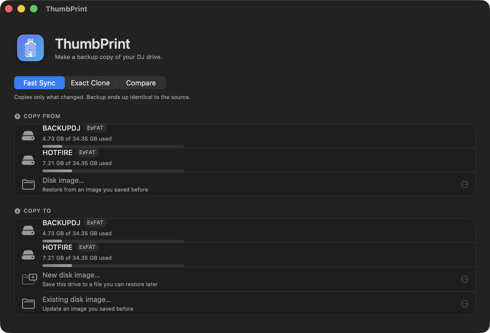

<div align="center">

# ThumbPrint

**Backup software for DJ drives.**
Copies a rekordbox or Serato USB drive onto another drive — or into a disk image — without ever writing to the original.

[](https://github.com/elDoof/ThumbPrint/releases/latest)
[](https://github.com/elDoof/ThumbPrint/releases/latest)
[](LICENSE)



</div>

---

## Install

1. Download the latest `ThumbPrint.dmg` from [Releases](https://github.com/elDoof/ThumbPrint/releases/latest).
2. Open it and drag **ThumbPrint** to Applications.
3. Launch it. The first time you plug in a drive, macOS asks for permission to access removable volumes — click **Allow**, or the drive list will come up empty.

The app is signed with a Developer ID and notarized by Apple, so it opens normally with no security warning and no right-click workaround.

Requires macOS 14 (Sonoma) or later, on Apple silicon or Intel.

## What it does

Pick a source drive and a destination, and choose how to copy:

| Mode | What it does | When to use it |
| --- | --- | --- |
| **Fast Sync** | File-level mirror. Copies only what changed and removes from the backup anything no longer on the source. | The everyday backup. A re-run of an unchanged library copies nothing. |
| **Exact Clone** | Bit-for-bit copy of the whole disk, behind the standard macOS admin prompt. | Reproducing a drive exactly, partition map included. |
| **Compare** | Reads both drives and reports what differs. Writes nothing at all. | Checking a backup you made months ago. |

Either side of a copy can also be a **disk image** instead of a drive, so a backup can be made with only one stick plugged in and restored onto a replacement later.

Before any copy starts, ThumbPrint checks the things that actually go wrong: free space on the real destination, a damaged source filesystem, a read-only target, and a rekordbox or Serato library whose database is older than the tracks around it — the reason a drive can look fine in Finder and still be missing songs in the player. Anything that would break the copy blocks it; anything that is merely worth knowing is shown as a warning. Afterwards every copied file is re-read and verified, and each drive is remembered, so the picker can tell you what a drive was last backed up to and when.

## Why it exists

A DJ drive that copies "successfully" and then won't load in a CDJ is the failure that matters, and general-purpose backup tools hit it easily:

- **Hidden folders.** Rekordbox keeps its library in `/PIONEER/` and Serato in `/_Serato_/`, both hidden. A tool that skips hidden files produces a backup that looks complete in Finder and is unusable in a player.
- **Two-second timestamps.** exFAT and FAT32 store modification times at 2-second resolution, so a byte-perfect copy reads back up to 2s off its source. Compare strictly and every single run re-copies the entire library.
- **Two spellings of the same name.** macOS hands back decomposed filenames while exFAT stores whatever was written, so accented track names index under two different keys across two drives and re-copy forever.

ThumbPrint handles all three, because it was built for exactly one job.

## The one rule

**ThumbPrint never writes to the source drive.** Everything else is negotiable; this is not.

It has been proven three ways: a static audit of every write path, a full sync from a source attached read-only so the kernel itself rejects any write, and a byte-level before/after snapshot of the source tree. When a source is used from a disk image, that image is attached read-only, which makes the guarantee automatic rather than a rule someone has to remember.

A consequence worth stating up front: there is no repair or format feature. When a source drive is damaged, ThumbPrint detects it, explains it, and hands off to Disk Utility. That is a design decision, not a gap.

## Status

Verified against real hardware: drive detection, Fast Sync and incremental re-runs, mirror deletion, verification, cancellation and resume, preflight blockers, and source health screening. ThumbPrint backups have loaded on real players twice — an 18.2 GB FAT32 → exFAT backup in a CDJ, and a full ~81 GB FAT32 → FAT32 backup on an XDJ-RX3 with rekordbox cue points intact.

Disk image save and restore is covered by 124 automated checks against real filesystems, but has not yet been run against a large library on real DJ hardware. **Exact Clone has not been tested against real hardware at all** — treat it as experimental and keep a second copy of anything you care about.

## Building from source

Requires Xcode 16 or later.

```bash
git clone https://github.com/elDoof/ThumbPrint.git
cd ThumbPrint
./Scripts/build.sh            # Debug build, then launch
./Scripts/build.sh release    # Release build, then launch
./Scripts/build.sh install    # Release build → /Applications, then launch
```

The project is ad-hoc signed, so it builds with no certificate and no account. `Scripts/release.sh` produces the signed and notarized disk image and is only useful to the maintainer.

Run the test suite before and after changing anything under `Model/` or `Services/`:

```bash
./Tests/run.sh
```

It builds its own throwaway exFAT volumes and disk images, runs 124 checks against real filesystems, and cleans up after itself. It writes nothing inside the repository and touches no real drive.

App Sandbox is off and must stay off — raw device I/O and access to arbitrary volumes are incompatible with it. There is no Mac App Store build.

## Documentation

[`docs/DEVELOPMENT.md`](docs/DEVELOPMENT.md) is the working reference: architecture, every load-bearing implementation detail and why it is load-bearing, the testing procedure, and the roadmap.

## License

[MIT](LICENSE) © 2026 Sascha Nowlin.

Not affiliated with, or endorsed by, AlphaTheta, Pioneer DJ, or Serato. rekordbox and Serato are trademarks of their respective owners.
